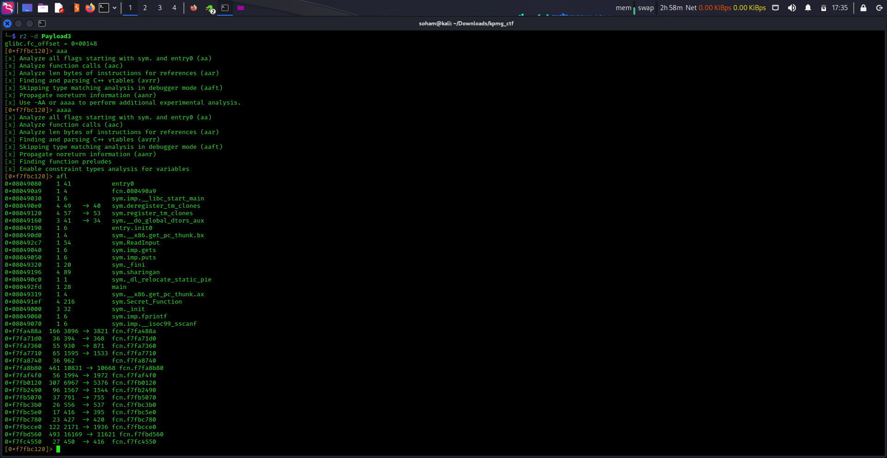
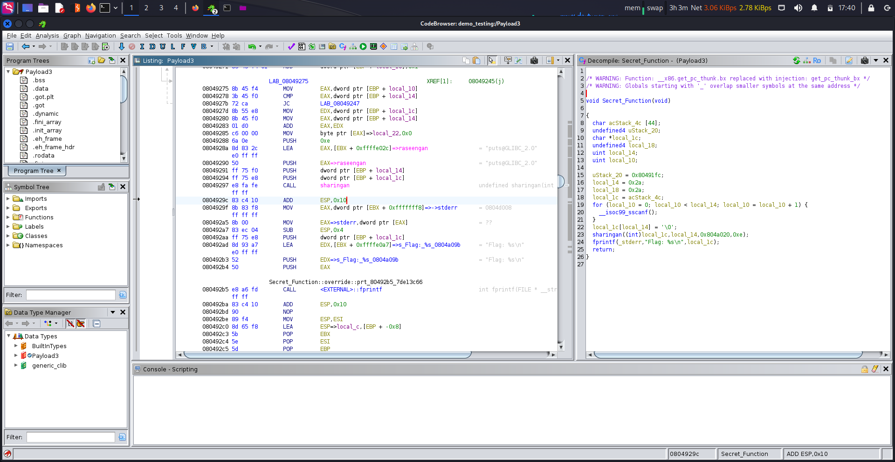
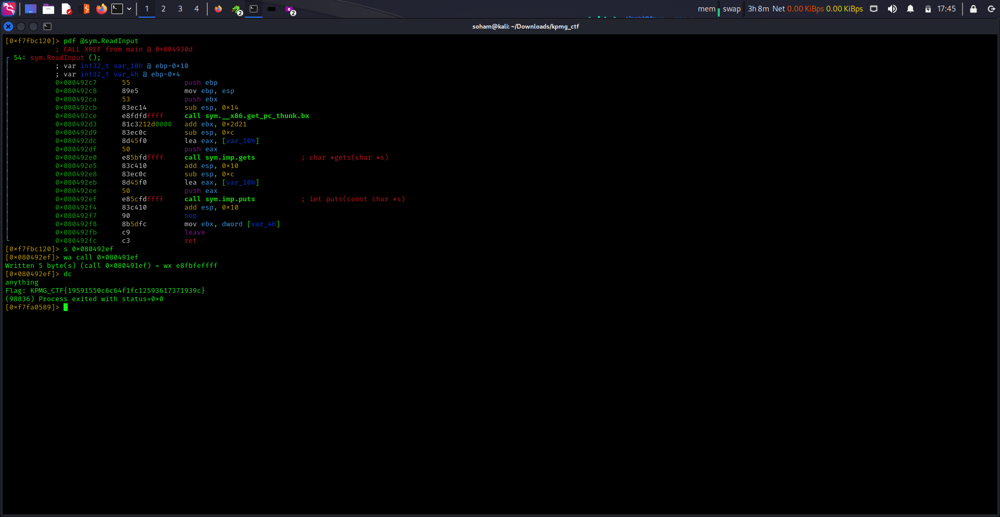

## Task :

A notorious organization, "The Enigma Syndicate," has sent encrypted messages detailing a dark conspiracy. Participants must tackle their binary cryptogram using powerful reverse engineering tool to reveal the sinister plot. Unravel the enigma, stop the conspiracy, and become the ultimate codebreaker in this thrilling CTF challenge!

[Payload3](Resources%20provided/Payload3)

## Points: 400

## Solution:
atfirst install radare2 and ghidra then move to the directory where the payload3 present
now execute all command one by one
r2 -d Payload3
aaa
aaaa
afl
now copy address of sym.Secret_Function  from this line only copy the address which is in hex [0x080491ef    4 216          sym.Secret_Function]
now execute
pdf @sym.ReadInput
now copy address of puts function call within this function [  0x080492ef      e85cfdffff     call sym.imp.puts           ; int puts(const char *s)] from this line only copy the hex address
now wxcute 
s 0x080492ef 
now execute 
wa call 0x080491ef
dc
you got the flag.......

take help from this screenshots

